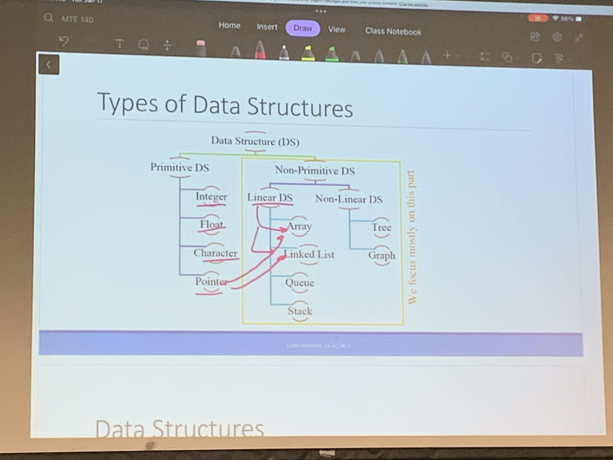

# Lecture 2 - Introduction to Algorithms and Data Structures
Jan 17, 2023

|To Do                      |Deliverables               |
|---------------------------|---------------------------|
|- Go to office hours <br>- rev objects|No CS this week <br> Optional Lab 0 (realsed Tues Jan 17, Friday Jan 27)<br> work on it in lab and finich it on own time|

<br>
<hr>
<br>

## Arrays vs. Data Structures
Array refers to a collection consisting of elements of homogeneous data type. 
Structure refers to a collection consisting of elements of heterogeneous data type.
https://www.geeksforgeeks.org/difference-between-structure-and-array-in-c/ 

<br>

## What is an Algorithimim?
- Algorithimim: a set of steps to accomplish a task
- an finite sequence of unambiguous instructuon preforend to achieve a goal or compute a desired result
- each alg is not a soln but a precosely defiend procedure for derive solns

Each alg should specify the following:
- name and purpose
- input
- output
- unambiguouly specified finite sequences of steps
- terminaton condition or terminating state (return)
```ruby
Algorithim: Name and purpose
    Input 
    Output
    Step 1: do the thing
    Step 2: do the stuff
    Return the ans
```


<br>

## Algorithim Descriptions vs. Pseudocode
Algorithim: is step-by-step procedure ro sole the problem in simple words.
Pseudocode: describes the algorithim in natural languae and mathematical notations

<br>

## Ex 1: Alg that returns the sum of 1, 2, 3, ..., n

Format of algrithim
```ruby
Algorithim: Sum of a series 
    Input: an integer *n* (eg, n = 2)
    Output: and interger or a number to store the result
    Step 1: for each integer 1 to n, sum up values in result
    Retrun the answer: display the value of the result
```

Alternate format of algrithim
```ruby
Algorithim : SomeOneToN
    Input: an integer *n* (e.g. 4)
    Output: an integer result to store the output. Initiate result to 0
    Step1: for each integer from 1 to *n*, add their values to result
    Return the ans: out put the val of result
```

Format of pseudocode
```ruby
Function (Input)
    Syntax1: Read the input
    Syntax2: Set some math = stuff
    Syntax3: If(_)
        do something
    Syntax4: print something
    Return the ans
```

Alternate format of pseudocode
```ruby
Function: SumOneToN(n)
    Syntax1: Read the input n = 4
    Syntax2: int result = 0
    Syntax3: for i = 0, ..., n-1:
        result += i
    Return the ans: return result
```

<br>

## Ex 2: Alg to find area of a rectangle
My ans to format pseudo code
```ruby
Function: find_area(l, w)
    Syntax1: Read the input l and w
    Syntax3: area = l*w
    Return the ans: return area
```

Actual Syntax
```ruby
find_area(int l, int w):
    area = l*w
    return area
```

<br>

## Data Structures
Algoritms operate on varous **data items** (eg, int, double, string)

A data structure is:
- a coherent organization of related **data items** for efficient storstorage  and usage
- and **methods** that operate on the data items (to acces, query and update them as quickly and easily)
Data structures are main components of creation of quick and powerful algorithims, which make code more readable and understandable.

<br>

## Types of Data Structures

Goal: Creating memory allocations

<br>

## Procedural Oriented Programming (C)
- All data items and structures are public
- a procdeure using functions to process the data
- they may be accidentally affected
- group programming platform

<br>

## Object Oriented Programming (C++)
- Allows a data structure's members to be private
- mthds (functions) that operate on these data items are included within the data structure
- users of the data structure use the public methods to achieve their goals, without accidently affecteing the private data items in any bad ways
- this is called encapsulation

<br>
<hr>
<br>

## Summary
- Algorithimim
    - is step-by-step procedure to sole the problem in simple words.
    - operate on various **data items** (eg, int, double, string
- Pseudocode
    - describes the algorithim in natural languae and mathematical notations
- A data structure 
    - a  organization of related **data items** 
    -  efficient storage and usage
- Methods
    - operate on the data items

<br>

## Questions
- Arrays vs. Data Structures?
    - Answer:
        - Array collection of same data type elements
        - Structure consisting of elements of different data types