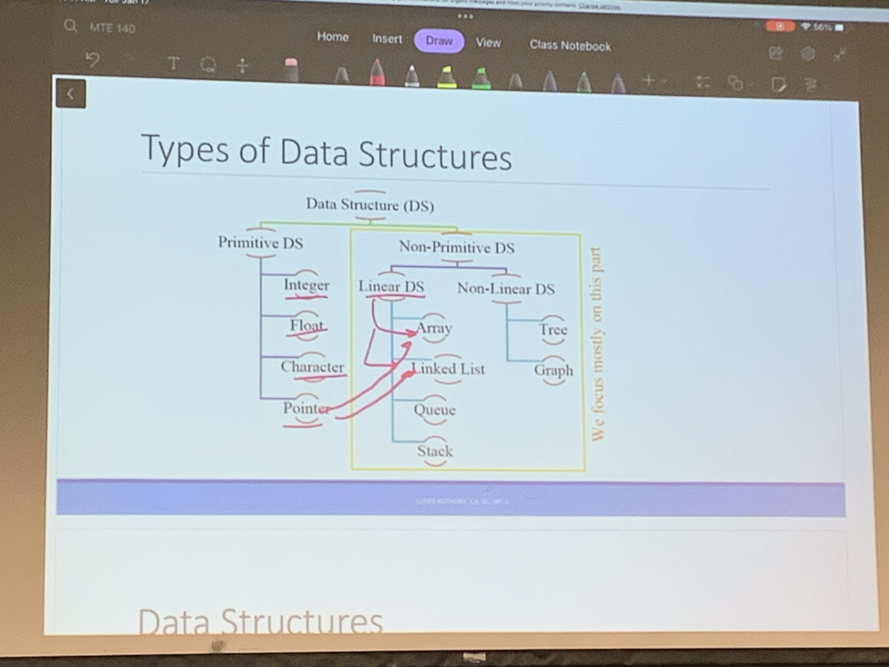

# Lecture 2
Jan 17, 2023

## To Do
- Go to office hours
- rev objects 

<br>

## Deliverables
No CS this week
Optional Lab 0 (realsed Tues Jan 17, Friday Jan 27)
Work on it in lab and finich it on own time

<br>

## Arrays vs. Data Structures
Array refers to a collection consisting of elements of homogeneous data type. 
Structure refers to a collection consisting of elements of heterogeneous data type.
https://www.geeksforgeeks.org/difference-between-structure-and-array-in-c/ 

<br>

## Definitions
Algorithimim: a set of steps to accomplish a task
Computer Science

<br>

..NA...

<br>

## What is an Algoritim?
- an finite sequence of ambiguous instructuon preforend to achieve a goal or compute a desired result
- each alg is not a soln but a precosely defiend procedure for derive solns

Each alg should specify the following:
- name and purpose
- input
- outpy
- unambiguouly  ....NA..

<br>

## Algorithim Descriptions vs. Pseudocode
Algorithim is step-by-step procedure ro sole the problem in simple words.
Pseudocode describle the algorithim in natural languae and mathematical notations

<br>

## Ex 1: Alg that returns the sum of 1, 2, 3, ..., n

```
Format of description
    Algorithim: Sum of a series 
    Input: an integer *n* (eg, n = 2)
    Output: and interger or a number to store the result
    Step 1: for each integer 1 to n, sum up values in result
    Retrun the answer: display the value of the result
```

Format of pseudocode
```
Function (Input)
    Syntax1: Read the input
    Syntax2: Set some math = stuff
    Syntax3: If(_)
        do something
    Syntax4: print something
    Return the ans
```

Alternate format of pseudocode
```
Function: SumOneToN(n)
    Syntax1: Read the input n = 4
    Syntax2: int result = 0
    Syntax3: for i = 0, ..., n-1:
        result += i
    Return the ans: return result
```

<br>

## Ex 2: Alg to find area of a rectangle
```
Function: find_area(l, w)
    Syntax1: Read the input l and w
    Syntax3: area = l*w
    Return the ans: return area
```

Actual Syntax
```
find_area(int l, int w):
    area = l*w
    return area
```

<br>

## Data Structures
Algoritms operate on varous data items (eg, int, double, string)
A data structure is:
- a coherent organization of related data items for effucuent storate and usage
- and methods that operate on the data items (to acces, query and update them as quickly and easily)
Data structures are main components of creatuon quick and oiweful algoritjm and make codes more readable and understandable

..NA...

<br>

## Types of Data Structures

Goal: Creating memory allocations

<br>

## Procedural Oriented Programming (C)
- All data items and structures are public
- a procdeure using functions to process the data
- they may be accidentally affected
- group programming platform

<br>

## Object Oriented Programming (C++)
- Allows a data structure's members to be private
- mthds (functions) that operate on these data items are inctuded within the data structure
- useres of the data structure use the public methods to achieve their goals, without accidently affecteing the private dtat items in any bad ways
- this is called encapsulation

<br>

## Conclusion

..NA..