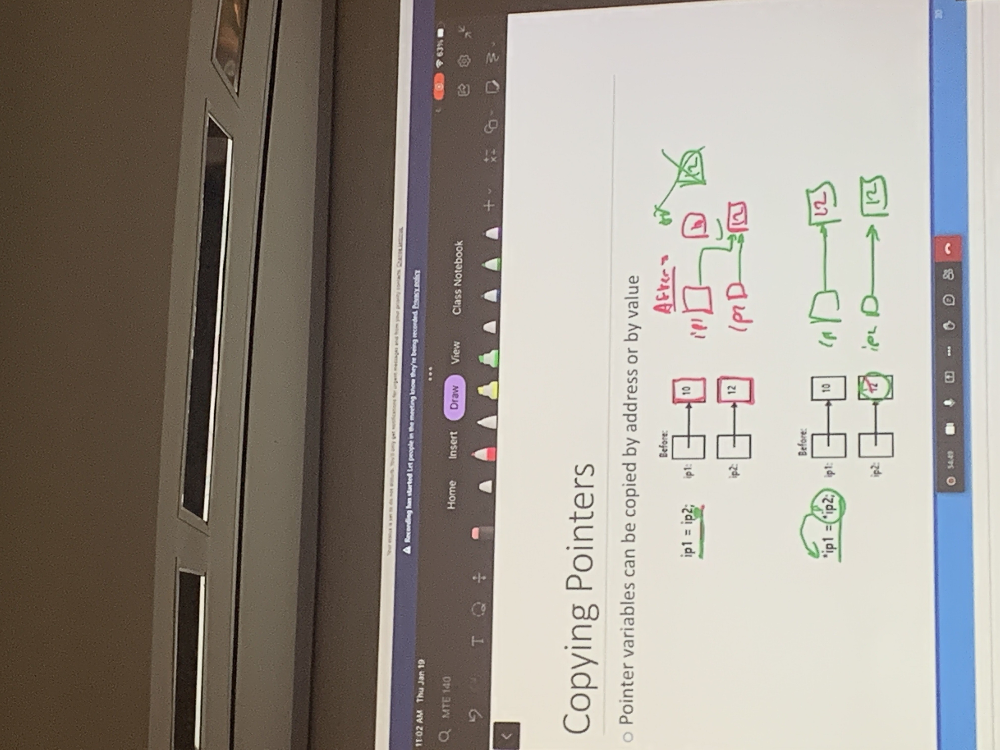
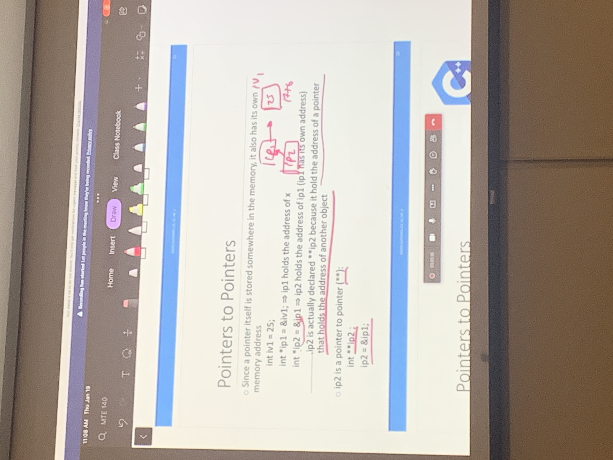
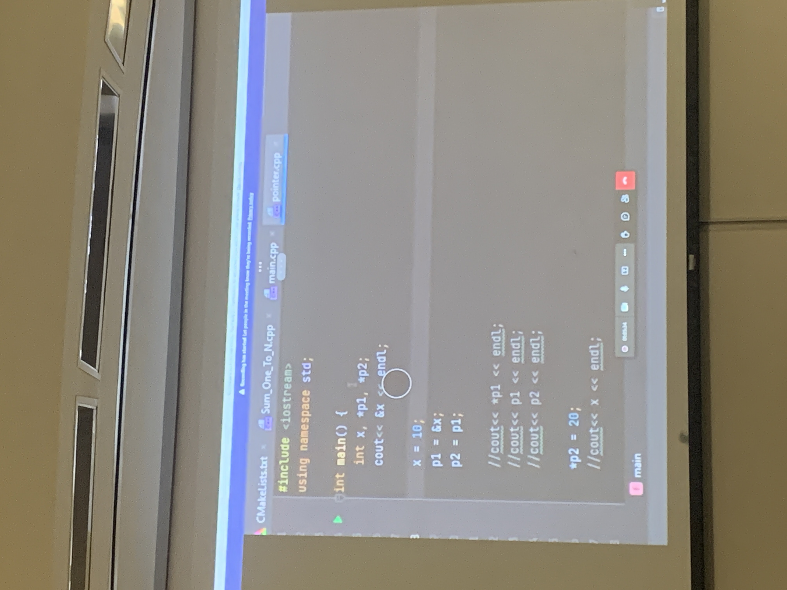
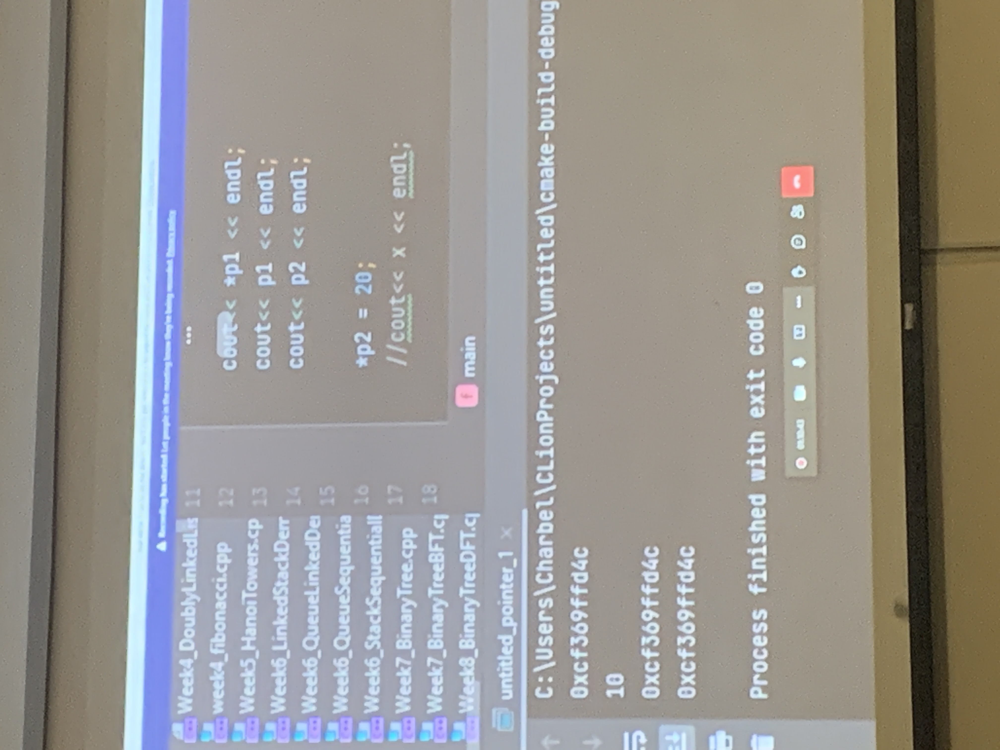

# Lecture 3 - C++ Implementation of Pointers
Jan 19, 2023

<br>

### TO REVIEW 
- Copying Pointers
- Pointers to Pointers
    - ex2.b
- Questions
- encapsulation

<br>

|To Do                      |Deliverables               |
|---------------------------|---------------------------|
|- Make sure to understand pointers|- Lab|

*Classes and ojects and DS Implementations

<br>
<hr>
<br>

## Classes vs Objects
- Class
    - reps a kind of oject
    - template for creating instances specific objects
    - it has members (attributes) and mthds
- Object
    - represents and indiv and specific item 
    - it is an instance of the general class

<br>

## Ex 1: Dealer Inventory Practice
Info needed, make, model, year, 

Data structure (SD) is a group of data itms
- each car is a data item (attributes)
    - diff types, colours, price, model
- each data item has mthds to operate on it
    - mthds/functions, add, print, etc

<br>

Struct
```ruby
struct Car{
    # all members are public by defults
    int year; 
    string brand; 
    double price; 
};
```
Classes
should not return anyuthing
```ruby
class CarRecord{
    # all members are private by default
    Car carinventory[100];
    int size = 0;

public:
    # no return anything
    # someone asked about mal practice changes in two places ?
    void addCar (int year, string, brand, double price);
    void printAll(); #? void?
}
```
In header? in class bad habit - encapsulate, to check work, to put bounds on something, hiding info, functions that just call other functions

this is private
functions go in header
incapsulations - accesss to everything
```ruby
void CarRecord::addCar(int year, string brand, double price){
        carinventory[size].year = year; 
        carinventory[size].brand = brand; 
        carinventory[size].price = price; 
        size++; 
void CarRecord::printAll(){
    for (int i= 0; i<size, i++){
        cout << "Car #" << i << carinventory[i].year << ":" << carinventory[i].brand << ":" << carinventory[i].price ; 
    }
}
```
Main
```ruby
int main(){
    CarRecord inventory;
    #add car 1
    inentort.addCar(2002, "Honda", 1000.00)
    inventory.printAll()
    return 0; 
}
```

Output
```ruby
>> Car #0: 2002 Honda, price
...
```

<br>

## Pointers
Definition: is a var that stores the memory address of another var. 
A pointer "points to" thet vars address
- like a storage unit number

<br>

## General info
Pointers: can store memory adresses of any type of data

Declaring a pointer with an askterick *
>int *ip; 
- ip is declared as a pointer to an int var
- ip holds `a pointer` to the address of the var of type int

<br>

## Address operator "*&*" (address-of-operator
used to det the address of a var 

```ruby
int *ip;
int iv1 = 25; # static memory
ip = &iv1; # no assigning contect of the var itseld *ip*, but only it's address
cout << iv1; # refer to iv1 directly and output 25
cout << i; # refers to the address of iv1 and outputs an address of 1776
```


<br>

## Dereference operator
acesses the "*value of*"
used to folloe the [pointer to its target
getting ip to give "25"

```ruby
int *ip; 
int iv1 = 25; 
ip = &iv1;  
cout << iv1; # refer yto iv1 directly and print int stored in var, which is 25
cout << ip; # refers to the address of iv1 and print memory address, which is 1776
cout << *ip; # refer to iv1 indirectly by using the derefferencing operand; ouput value of the address that "ip" is pointing to, which is 25
```
Output
```
>> 25
>> 1776
>> 25
```

<br>

## Ex 2 Copying Pointers
pointer always points to the adress


<br>

## Pointers to Pointers (I dont understand)
Since a pointer itself is stored somewhere in the memory its also hat its own memory address

```ruby
int iv1 = 25
// ip1 holds the address of x 
int *ip1 = &iv1;
// ip2 holds the adress of io1 (ip1 its ownadres) ip2 is acturally declared **ip2 bc it hold the address of a pointer that holds the adress of another odject
int *ip2 = &ip1; 
```

ip2 is a ponter to a pointer (**)
```ruby
int **ip2; 
ip2 = &ip1; 
```


<br>

## Ex 2.b (Make sure to understand) 
Rewrite code from Week1_pointer.cpp
Main code

Output

edit!! ..nA...

terminating code resets

<br>

## Why do we use Pointers?
- support datda - linked lists
- function manipulation to the input var
- direct memory access and manipulation

<br>
<hr>
<br>

## Summary

- Class
    - reps a kind of oject
    - template for creating instances specific objects
    - it has members (attributes) and mthds
- Object
    - represents and indiv and specific item 
    - it is an instance of the general class
- Pointers
    - Definition: is a var that stores the memory address of another var. 
    - A pointer "points to" thet vars address
    - like a storage unit number
    - can store memory adresses of any type of data
    - Declaring a pointer with an askterick *
        - ip is declared as a pointer to an int var
        - ip holds `a pointer` to the address of the var of type int
        - >int *ip; 
- Address operator "*&*"
    - used to det the address of a var 
- Dereference operator
    - acesses the "*value of*"
    - used to folloe the [pointer to its target
    - getting ip to give "25"
- Ex 2 Copying Pointers
    - pointer always points to the adress
- Pointers to Pointers (I dont understand)
    - Since a pointer itself is stored somewhere in the
    - memory its also hat its own memory address
    - >int **ip2; 

<br>

## Questions
- classes refresher / structure of creating a class
    - name, parameters
    - public / private
    - functions (parameters of vars def in class)
    - returns
     
    - class is named Tea :: Tea()
        - within scope
        - 1 st Tea is class in the header file
        - 2 nd Tea is the mthd that constructor(creates) instance of tea (tea1, tea2) 

    - instance of the class
        - tea1::tea(parameters)

- public and private uses and otimization
    - public used in other files
    - private: in class or friend (list of clasess that are alowed to access ur private stuff (within class))

- header file etc, and cpp organization
    - header clasess, functions
    - cpp call funcs inside class and disp ans

- Ex 1
    - class question mal prac
    - set at 100 or add untill 100 etc?
        - set size of array 
        - vector if nededs
    - do we have to add a return 0 in all main??
    - struct
        - simple class that just have vars, used to pass through vars, must be public
- Dynamic memory vs static memory allocation
    - Dyn mem: num bytes on heap (not hardware), storing in specific place. Get rid later. 
    - stack opp of heap, gets out of scope disapears
    - malloc
- ++b/c++
Does change vales
    - 3++ = 4, but ret previous val
    - ++3 = 4, but ret previous after

Implicitly and 
inside class instance inside running on is implicit 
this
this means current instant of class

Explicit means self

changing parameters and types

<br>